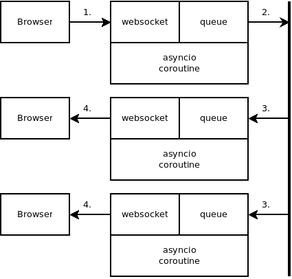

class: center, middle

# Introduction to asyncio in Python

#### Zsolt Cserna (@csernazs)
##### Software Engineer @ One Identity


---
# Purpose of this talk

### Give an introduction to asynchronous I/O introduced in python 3.4
* addresses common problems related to asynchronous programming
* completely different paradigm
* not limited to networking
* implementation independent, extendable

---
# Purpose of this talk
### By the end of the talk
* you will have better understanding of the new language-level features (async/await)
* you will be able to implement your own network server and client implementing any network protocol
* you will be able to implement a websocket server

---
# Agenda

1. `async`/`await` keywords
1. History, how we got here
1. asyncio implementations
  1. curio: the new, easy-to-use API
  2. asyncio: the standard
  3. quart: the websocket
2. In-depth `yield` usage

---
class: center, middle

# Fundamentals of asynchronous programming

---
# Differences between synchronous and asynchronous
* Synchronous
  * Can block the current thread or process for indefinite time
  * Waits until it has some results or error
* Asynchronous
  * Returns immediately
  * Can return with incomplete or no results
  * May need further check for the actual result

--

# Examples
* `connect()`
  * Synchronous: blocks until the connection is established or an error happened
  * Asynchronous: returns immediately. A further `select()` or `poll()` or similar needs to be called to check the result.
* `recv()`
  * Synchronous: blocks until at least one byte can be read from the socket
  * Asynchronous: returns immediately with the content of the recv buffer (with the bytes arrived since the last _recv_ call)

---
# Callback hell
> _The situation where callbacks are nested within other callbacks several levels deep, potentially making it difficult to understand and maintain the code._ — Wiktionary

--

## Simplest case
* Add a parameter to `recv()`,  `connect()`, `http.get(url)`, etc to accept a function which will be called when the operation completes

```js
// Make a request for a user with a given ID
axios.get('/user?ID=12345')
  .then(function (response) {
    // handle success
    console.log(response);
  })
  .catch(function (error) {
    // handle error
    console.log(error);
  })
  .then(function () {
    // always executed
  });
```

---

## Python implementation: Twisted
* Each asynchronous function returns a Deferred object
* Attach your functions (callbacks) to the deferred object
* Fire the mainloop

--
* Let the madness begin...

---
# Problems

* Code needs to be written in a significantly different way
* One big function needs to be split into many small functions

--
* State of the function is not preserved: local variables needs to be passed around
* ...or global state needs to be used

--
* All the stack traces will show mainloop as the caller but it is extremely difficult to track why the function is called actually

--
* State of the program is scattered


---
class: center, middle

# `async`/`await` in python


---
# Example: echo server

```python
from curio import run, spawn
from curio.socket import *

async def echo_server(address):
    sock = socket(AF_INET, SOCK_STREAM)
    sock.setsockopt(SOL_SOCKET, SO_REUSEADDR, 1)
    sock.bind(address)
    sock.listen(5)
    print('Server listening at', address)
    async with sock:
        while True:
            client, addr = await sock.accept()
            await spawn(session, client, addr, daemon=True)

async def session(client, addr):
    print('Connection from', addr)
    async with client:
        while True:
            data = await client.recv(100000)
            if not data:
                break
            await client.sendall(data)
    print('Connection closed')

if __name__ == '__main__':
    run(echo_server, ('',25000))
```

---
# Look at the code

* Single-threaded
* `async` defines that the function is a coroutine
* `await` suspends the execution, and gives the control back to the mainloop
* mainloop decides which coroutine should be awaken

--

## Example
`data = await client.recv(100000)`

--
1. Suspends execution

--
1. Mainloop receives the request to receive at most 100000 bytes from the `client` socket

--
1. Time passes...

--
1. Data arrives

--
1. Mainloop awakes the coroutine

--
1. Data received will be returned from the `await` statement

--
1. Program execution goes "as usual" to the next `await` statement

---
# Single threaded by default
* It is single threaded which is awesome, because:
  * Python is not very performant in multi-threaded environment
  * Global state is fully controlled, no surprises
  * Each coroutine specifies when to give up execution (by the `await` statement)
  * No I/O handling between `await` calls
  * Last resort: run the blocking code in a thread

* Do not do
  * CPU-heavy calculations
  * Blocking operations (sleep, read, write, etc..)

```python
data = await client.recv(1000)
# do something CPU heavy
# or blocking
data = await client.recv(1000)
```

---
# Why curio?
* Much better API compared to standard library's asyncio
* API is as close to standard library's other APIs as possible
  * socket
  * subprocess
  * threading
* Streaming API: one stream object for reading and writing
* Wrapping "usual" file-like objects into streams (such as stdin/stdout/stderr)
* Provides synchronization primitives
  * Queue
  * Event
  * Lock


---
# Queue example

```python
import curio

async def producer(queue):
    for n in range(10):
        await queue.put(n)
    await queue.join()
    print('Producer done')

async def consumer(queue):
    while True:
        item = await queue.get()
        print('Consumer got', item)
        await queue.task_done()

async def main():
    q = curio.Queue()
    prod_task = await curio.spawn(producer(q))
    cons_task = await curio.spawn(consumer(q))
    await prod_task.join()
    await cons_task.cancel()

curio.run(main())
```

---
# Why not curio?

* Not built on top of standard library's asyncio 😭
* Compatibility with other libaries is not a goal. -- https://github.com/dabeaz/curio 🥅


---
class: center, middle

# Standard library `asyncio`

---
# Echo server

```python
import asyncio

async def handle_echo(reader, writer):
    data = await reader.read(100)
    message = data.decode()
    addr = writer.get_extra_info('peername')

    print(f"Received {message!r} from {addr!r}")

    print(f"Send: {message!r}")
    writer.write(data)
    await writer.drain()

    print("Close the connection")
    writer.close()

async def main():
    server = await asyncio.start_server(handle_echo, '127.0.0.1', 8888)

    async with server:
        await server.serve_forever()

asyncio.run(main())
```

---
# Look at the code

* Some functions such as `asyncio.run` got introduced in python 3.7
* Streaming abstraction (reader and writer)
* `writer.write()`: passes data to socket's non-blocking `send()`
* `writer.drain()`: write until the output buffer reaches low watermark
* `writer.close()`: closes the underlying socket. No await here...
* Close should be used together with `await writer.wait_closed()`

---
# Why asyncio?

* It's standard
* Large ecosystem. Compatibiltiy should not be an issue. See https://github.com/aio-libs.
* Using http or other higher level protocol is definitely much easier
* Use it with python 3.7 at least (when possible)
* Read both the latest version's documentation and the one for the actual python version
  * Find the _New in python x.y_ text for API compatibility

---
# Why not asyncio?

* Not like other parts of the standard library (eg. socket, subprocess, etc)
* API fixes
  * `drain` and `wait_closed`
  * Naming issues: `asyncio.get_event_loop()` may create a new event loop


---
class: center, middle

# Websocket programming with Quart


---
# Websockets in a nutshell
* Provides bi-directional communication with the server in the same connection
* Arbitrary data can be sent
* Communication starts with a protocol handshake via HTTP
  * Most notably with the `Connection: Upgrade` header

---
# Quart in a nutshell

* Library with Flask compatible API
  * Tries to be 100% compaible
* "Just throw in some async / await statements"
* Supports websockets
* Uses ASGI instead of WSGI
  * Too many ASGI implementations: hypercorn, uvicorn, daphne

---
class: center, middle

# Demo time
# 🤞

https://bit.ly/2yv5ON8


---
# Overview




---
class: center, middle

# How much do you know about the **`yield`** statement?

---
# The simplest case

```python
def g():
    yield 1
    yield 2
    yield 3

for i in g():
    print(i)
```
--
What will `g()` result (without the `for` loop)?

--
* generator object


---
# The iterator pattern

What will be the result of the last `print`?

```python
def g():
    yield 1
    yield 2
    yield 3

generator = g()
iterator = iter(generator)
print(next(iterator)) # prints '1'
print(next(iterator)) # prints '2'
print(next(iterator)) # prints '3'
print(next(iterator)) # ???
```
--
* `StopIteration` exception tells the `for` loop to terminate
* For generator objects, `iter(generator)` is the same as `generator`

---
class: center, middle

# Now comes something completely different

---
# Result of the `yield` statement

What will be the order of the print statements?

```python
def g():
    print("g started") # 2 or 3?
    v = yield 1
    print("v", v) # ???

print("start") # 1.
generator = g()
print("g() called") # 2 or 3?
result = next(generator)
print("result from the next() call", result) # 4 maybe?
```
--
```python
generator.send(2)
```

---
# Sending object to the generator
```python
def g():
    print("g started")
    v1 = yield 1
    v2 = yield 2
    v3 = yield 3
    print("Received:", v1, v2, v3)

generator = g()

# prints 1, jumps to the first yield
# v1 assignment is not completed yet
print(next(generator))

# v1 assignment is completed
# prints 2, jumps to the next yield
print(generator.send("s1"))

# v2 assignment is completed
# prints 3, jumps to the next yield
print(generator.send("s2"))

# v3 assignment is completed
# no more yield -> StopIteration is raised
generator.send("s3")
```

---
# Sidenote: throwing exceptions to generator
```python
def poor_guy():
    yield 1


generator = poor_guy()
print(next(generator)) # prints '1'
generator.throw(ValueError("some error"))
```

---
class: center, middle

# Ok, but what's the point?

---
# Juggling with generators

```python
def echo():
    received = None
    while True:
        received = yield received

# create some generators
e1 = echo()
e2 = echo()
e3 = echo()

# get to the first yield, which will yield None
e1.send(None) # same as next(e1)
e2.send(None) # same as next(e2)
e3.send(None) # same as next(e3)

# wake up generators in arbitrary order
# one generator is "alive" until it reaches the next yield, or returns
print(e2.send("a"))
print(e3.send("b"))
print(e1.send("c"))
```
--
* generators can be used without for loop

--
* local variables (stack frame) preserved

--
* generators can be waken up at any given time, and have control on when to give up execution

--
* conversation can be established, a.k.a. _message passing_

---
# I have an idea

* Implement a server
* Let's have a generator created for each connection
* When the generator wants to do something, it should `yield` an object describing the intent

```python
def recv(fd, size):
    return {"op": "recv", "fd": fd, "size": size}

def g():
    data = yield recv(fd=24, size=1024)

gen = g()

# this is what a mainloop is doing
op = next(gen)
while True:
    if op["op"] == "recv":
        # add the given fd to epoll()
        # register that `gen` needs to be awaken when data arrives
    if is_activity_on_fd(): # epoll says that someone sent us some data
        # let epoll to wait until data arrives, when it arrived, wake up `gen` like this:
        op = gen.send(received_data)
```

---
# We are almost there...

* Please replace word _generator_ with the word _coroutine_ from now
  * generator: when it is used in a `for` loop
  * coroutine: when advanced semantics are used such as `send`/`throw` and `for` loop is not used

---
# yield from

* Task: implement a generator/coroutine which proxies the values of another generator

Piece of cake:

```python
def recv(fd, size):
    yield {"op": "recv", "fd": fd, "size": size}

def g1():
    # let's say it parses some data, eg does the HTTP request parsing
    yield recv(fd=24, size=1024)

def g2():
    for i in g1():
        yield i
```

--
* ...what about `send()` and `throw()`?

--
* `yield from` takes a generator/coroutine and proxies next/send/throw calls

--
* See [PEP 380](https://www.python.org/dev/peps/pep-0380/) (available since python 3.3)

---
# yield from example

```python
def recv(fd, size):
    yield {"op": "recv", "fd": fd, "size": size}

def g1():
    # let's say it parses some data, eg does the HTTP request parsing
    yield from recv(fd=24, size=1024)
    return "some value"

def g2():
    return_value = yield from g1()
    print("return value from g1():", return_value)

print(list(g2())) # ???
```


---
# Connecting it with async/await

* This is how it started
  * The syntax below is now deprecated in python 3.8
* Add `@coroutine` decorator
* Start the code with `asyncio.run()`

```python
import asyncio
from asyncio import coroutine

@coroutine
def g1():
    # let's say it parses some data, eg does the HTTP request parsing
    print("sleeping a bit...")
    yield from asyncio.sleep(1)
    return "some value"

@coroutine
def g2():
    return_value = yield from g1()
    print("return value from g1():", return_value)

if __name__ == "__main__":
  asyncio.run(g2())
```

---
# Connecting it with async/await

* Replace `yield from` with `await`
* Add `async` to every function which have `await` in it
* Profit!


```python
import asyncio

async def g1():
    # let's say it parses some data, eg does the HTTP request parsing
    print("sleeping a bit...")
    await asyncio.sleep(1)
    return "some value"

async def g2():
    return_value = await g1()
    print("return value from g1():", return_value)

if __name__ == "__main__":
  asyncio.run(g2())
```

---
# Summary

--
* Examples for asynchronous programming: _curio_, _asyncio_, and _quart_

--
* How `yield` behaves in a generator case, when it is used by the `for` statement

--
* How `yield` behaves in a coroutine case, when `send()` `throw()` is called on it

--
* How `async`/`await` made possible in python by re-using the original concept

---
class: center, middle

# Q&A

